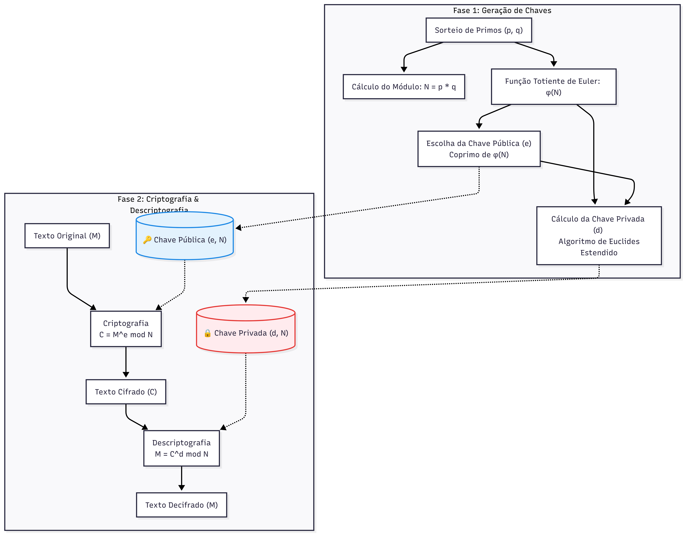

### 🔐 RSA-Criptografia (From Scratch)

**Implementação do algoritmo RSA do zero: da geração de primos à exponenciação modular**

Toda conexão HTTPS na web depende de criptografia assimétrica, mas poucos desenvolvedores entendem a matemática que acontece por baixo dos panos. Este projeto (desenvolvido como trabalho final de Matemática Discreta) resolve esse gap de conhecimento implementando o RSA 100% do zero em Python, sem o uso de bibliotecas prontas de criptografia.

---

#### 💡 O Problema que Este Projeto Resolve

A maioria dos tutoriais de criptografia apenas ensina a importar uma biblioteca (como a `cryptography` no Python). O objetivo aqui foi provar o domínio sobre **Algoritmos e Estruturas de Dados**, lidando manualmente com matemática de grandes números, testes de primalidade e o Algoritmo de Euclides Estendido.

---

#### 🏗️ Arquitetura Matemática do Algoritmo

Para facilitar o *onboarding* de quem está estudando o código, aqui está o fluxo exato implementado no projeto para a geração das chaves e a troca de mensagens:



---

#### 🧠 Conceitos Chave Implementados

Se você for explorar o código-fonte, preste atenção nestas três engrenagens principais que foram escritas manualmente:

1. **Geração de Números Primos:** O sistema gera candidatos e utiliza algoritmos matemáticos para atestar a primalidade, essenciais para gerar o `p` e o `q`.
2. **Algoritmo de Euclides Estendido:** Utilizado para encontrar o Inverso Multiplicativo Modular. É graças a essa função que conseguimos gerar a Chave Privada `d` a partir da Chave Pública `e`.
3. **Exponenciação Modular:** O coração da criptografia RSA (`M^e mod N`). Feita de forma otimizada para que o computador não trave ao tentar elevar números gigantescos antes de extrair o módulo.

---

#### 🛠 Stack Tecnológica

| Responsabilidade | Tecnologia |
| ------ | ------ |
| **Linguagem** | Python 3 |
| **Domínio** | Matemática Discreta, Teoria dos Números |
| **Dependências** | Nenhuma (Pure Python) |

---

#### ⚙ Como Rodar Localmente

**Pré-requisitos:** Apenas Python 3 instalado na sua máquina.

1. **Clone o repositório:**
   ```bash
   git clone https://github.com/Dom1ng0s/RSA-Criptografia.git
   cd RSA-Criptografia
   ```
2. **Execute o programa principal:**
   ```bash
   python main.py
   ```
   *(Nota: Se o seu arquivo principal tiver outro nome, substitua `main.py` pelo nome correto).*
3. **Siga as instruções na tela** para gerar seu par de chaves, digitar uma mensagem, vê-la sendo transformada em números incompreensíveis e depois sendo decifrada com sucesso!

---

#### 👤 Autor
**Davi Domingos de Oliveira**  
Estudante de Ciência da Computação — UFAL | Backend Developer
